# NCCL-Benchmarks on Alps

This a little project that helps set up the
[nccl-tests](https://github.com/NVIDIA/nccl-tests) on Alps using custom
**uenv**s and running a bunch of **allgather** benchmarks with different configurations.

## Build Instructions

### Creating the uenv

The recipe for the **uenv** is located in `uenv-recipe`. You will need
[stackinator](https://github.com/eth-cscs/stackinator), see the
[docs](https://eth-cscs.github.io/stackinator/configuring/) for information on
how to configure and build the stack. The recipe needs to be specialized for
the intended vCluster, so you'll also need
[alps-cluster-config](https://github.com/eth-cscs/alps-cluster-config).

The process should look roughly like this:

1. Allocate a compute node for building

        salloc -N 1 --time=05:00:00 --account <my-account>

2. Run interactively once the allocation has been granted

        srun --nodes=1 --pty bash -i

3. Go to the recipe folder and configure the stack

        cd uenv-recipe
        /path/to/stackinator/bin/stack-config \
            -c /path/to/cache-config.yaml \
            -b /dev/shm/$USER/stack-build \
            -s /path/to/alps-cluster-config/todi \
            -m /user-environment \
            -r . \
            --develop
        cd /dev/shm/$USER/stack-build
        env --ignore-environment http_proxy="$http_proxy" https_proxy="$https_proxy" no_proxy="$no_proxy" PATH=/usr/bin:/bin:`pwd`/spack/bin HOME=$HOME make store.squashfs -j200

4. Add the stack to the uenv repository

        uenv image add nccl-tests/<desc>:v<x>@clariden%gh200 /dev/shm/$USER/stack-build/store.squashfs

5. Quit the interactive session

## Run Instructions

The `run.sh` script launches a range of jobs. It takes as arguments changes to
the environment variables, as well as the particular uenv to use. The script is
intended to be run on the login node. An example invocation would be:

    ./run.sh NCCL_IGNORE_CPU_AFFINITY=1 nccl-tests/nccl-2.23.4-1-aws-1.13.0:v0

This will run the benchmarks with the `NCCL_IGNORE_CPU_AFFINITY` environment
variable set to `1` and the `nccl-tests/nccl-2.23.4-1-aws-1.13.0:v0` uenv.

The script will create a directory `results` in the current working directory
and write the output of the jobs there. Under the results directory, it will
create a subdirectory for the particular configuration according to the
environment variables and uenv, where the output of the jobs will be stored.
After the jobs have finished, you can run the `postprocess.sh` script in the
subdirectory to generate a summary of the results which can the later be used
to generate plots with the `plot_results.py` script.

The default environment variables are set in the `run.sh` script:

    
    CUDA_CACHE_DISABLE=1
    MPICH_NO_BUFFER_ALIAS_CHECK=1
    MPICH_OFI_STARTUP_CONNECT=1
    MPICH_SMP_SINGLE_COPY_MODE=NONE
    MPICH_GPU_SUPPORT_ENABLED=0
    MPICH_OFI_CXI_COUNTER_REPORT=2
    MPICH_COLL_OPT_OFF]=mpi_allgather
    NCCL_CROSS_NIC=0
    NCCL_NET_GDR_LEVEL=PHB
    NCCL_NET]="AWS Libfabric"
    FI_CXI_DISABLE_HOST_REGISTER=1
    FI_MR_CACHE_MONITOR=userfaultfd
    FI_CXI_RX_MATCH_MODE=software
    FI_HMEM_CUDA_USE_GDRCOPY=1
    NCCL_TESTS_DEVICE=0

## Results

Results are plotted for different message sizes. The legends indicate the difference with respect to the default environment variables.
The `nccl` version is fixed at `2.23.4-1` while there are two versions of the `aws-ofi-plugin`: `1.9.2` and `1.13.0`. The hatched bars
indicate that the sanity check has failed and wrong results were received.

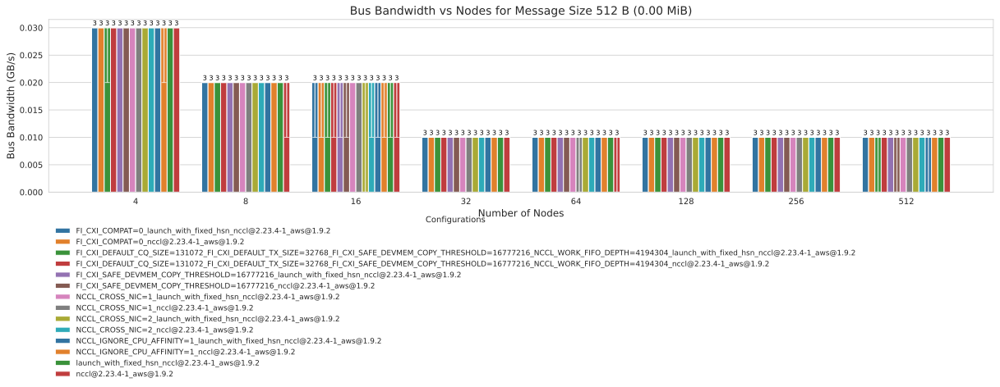

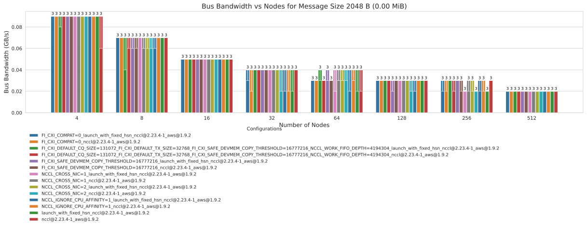
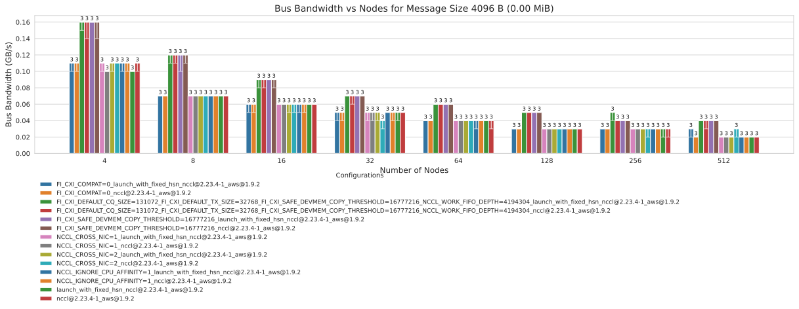

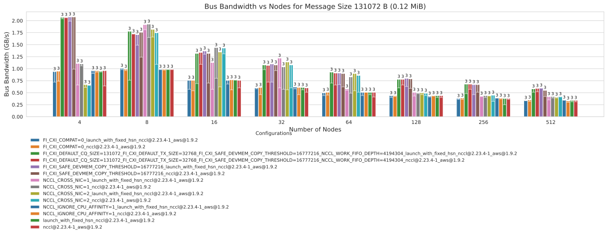
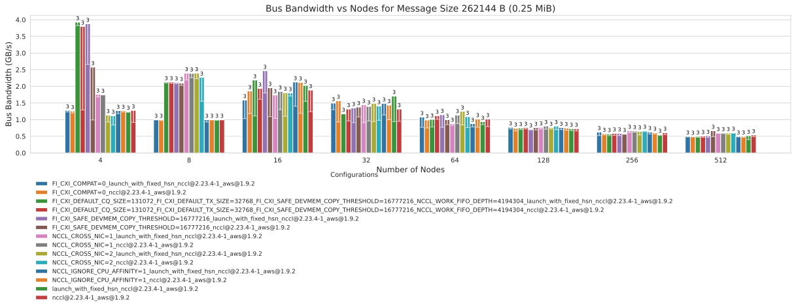
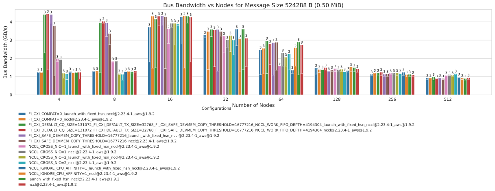
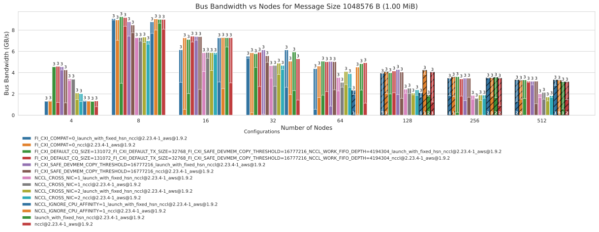

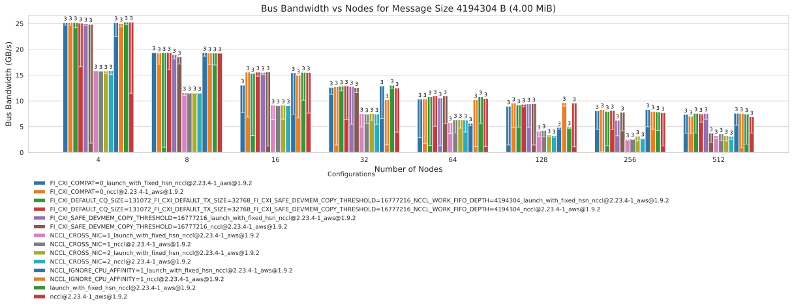
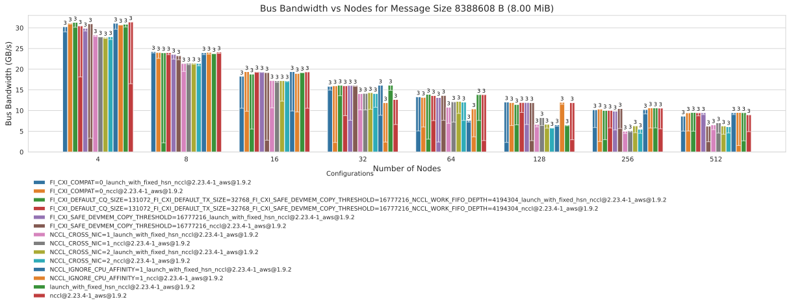
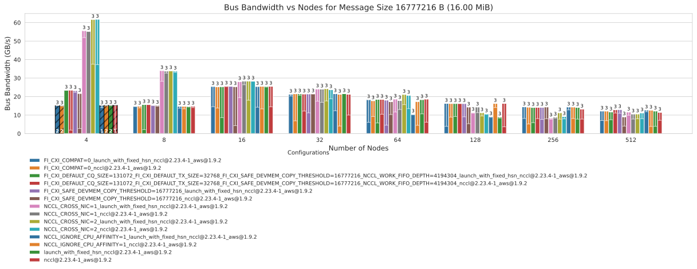
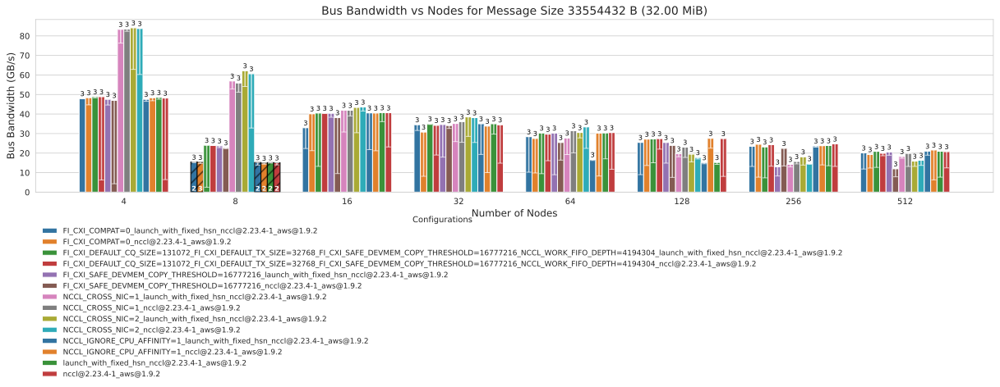

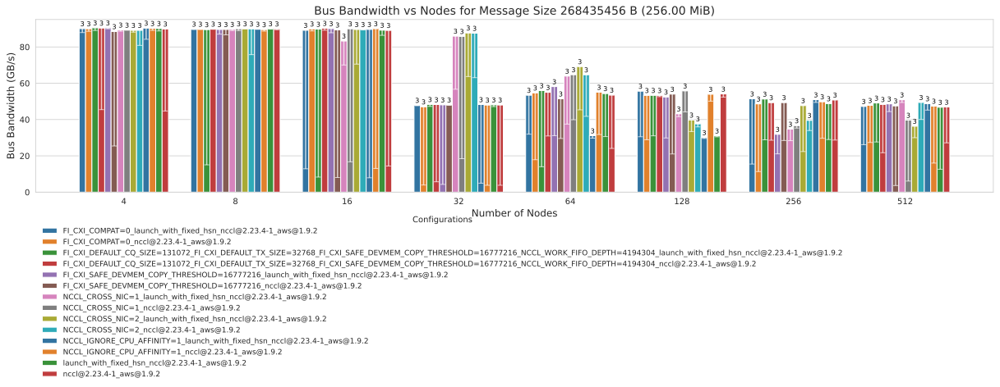
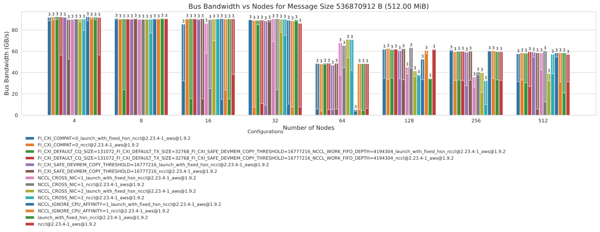
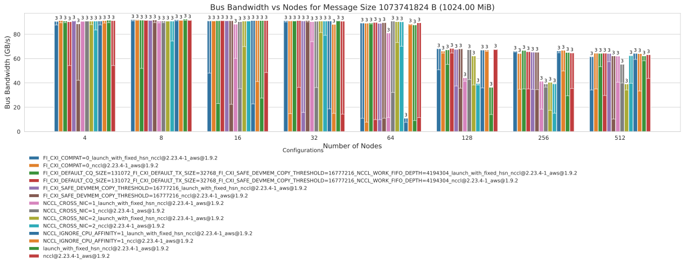
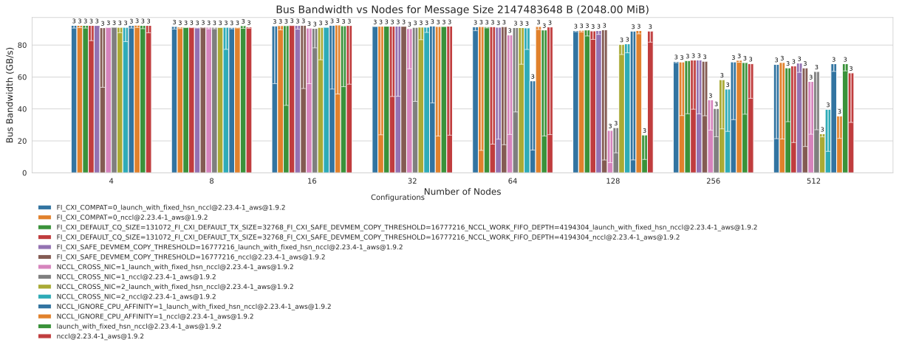
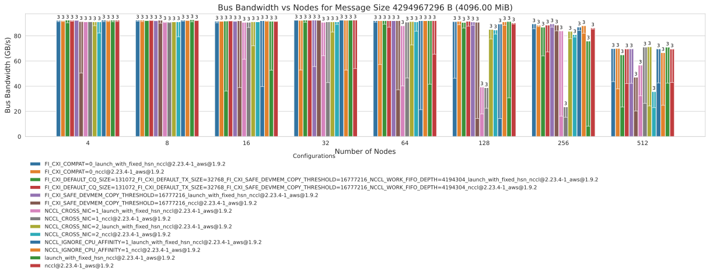

